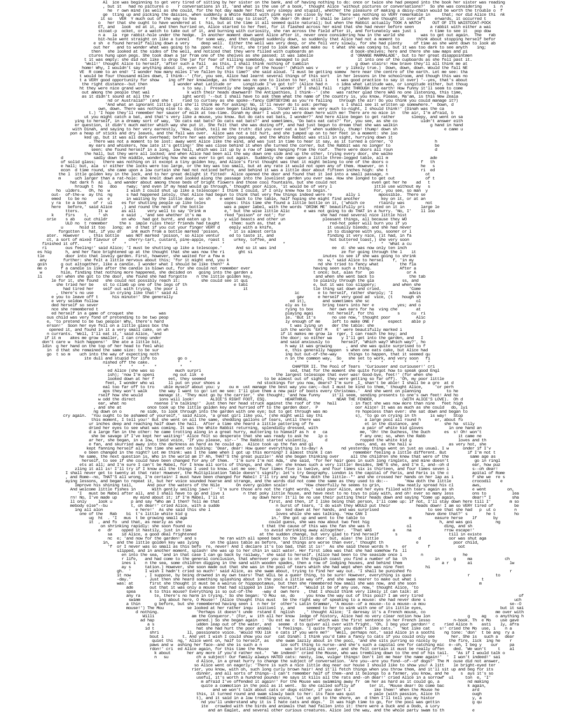

# storypictures.js
A javascript library to make pictures with stories (or any string). The only dependency is [ROT.js](https://github.com/ondras/rot.js/). Supports browser, require.js, Webpack and any other module loader you could possibly think of. The online demo of this library is at [my website](http://thegreatrambler.com/code-demos/storypictures/index.html).



## API

```javascript
var ctx = storypictures(data);
```
Data is a object with the following properties:

### img

```javascript
var img = new Image();
img.onload = function() {
  data.img = img;
}
img.src = "test.png";
```
The image parameter can either be a image object or a canvas context.

### story

```javascript
$.ajax({
  url: "story.txt"
}).done(function(result) {
  data.story = result;
});
```
The story parameter is the string which you want to conform to the picture. You can also use an array of objects. This gives you the freedom to specify the color of the the text. You can use this to make text that is bold and text that is not by making the default grey and change some text to black.

```javascript
data.story = [{
  n: "l",
  c: "#000000"
}, {
  n: "e",
  c: "#001100"
}, ...];
```

### solidityFunc -- optional!

```javascript
data.solidityFunc = function(r, g, b, alpha) {
  var luma = 0.2126 * r + 0.7152 * g + 0.0722 * b;
  if (luma < 40) {
    return true;
  } else {
    return false;
  }
};
```
The function used to determine wether a given spot will not have text at it. The default function returns `true` if the spot is dark (black).

## Return value

```javascript
var ctx = storypictures(data);
document.body.appendChild(ctx.canvas);
```
The function returns a canvas context that you can use to put in the dom or similar.

# License
MIT
